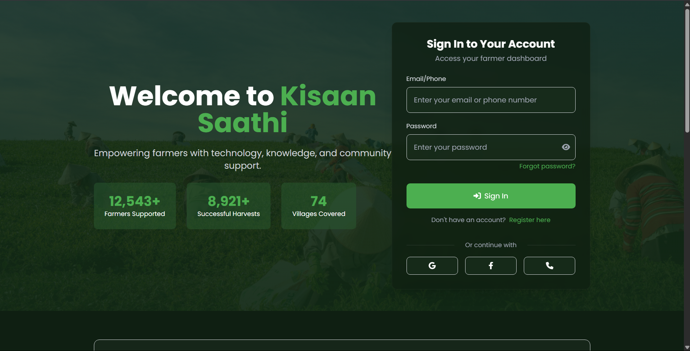
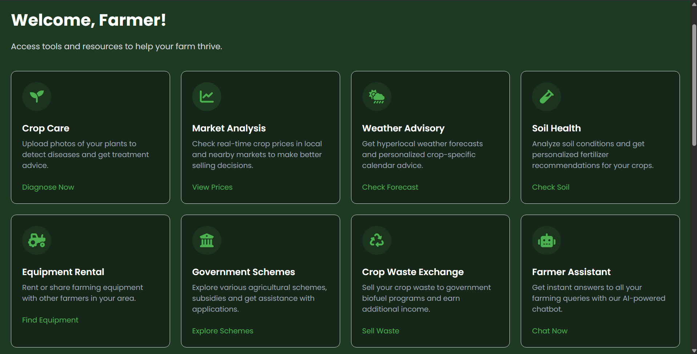
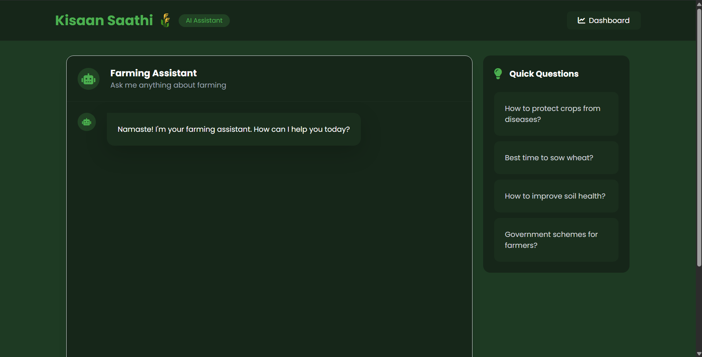
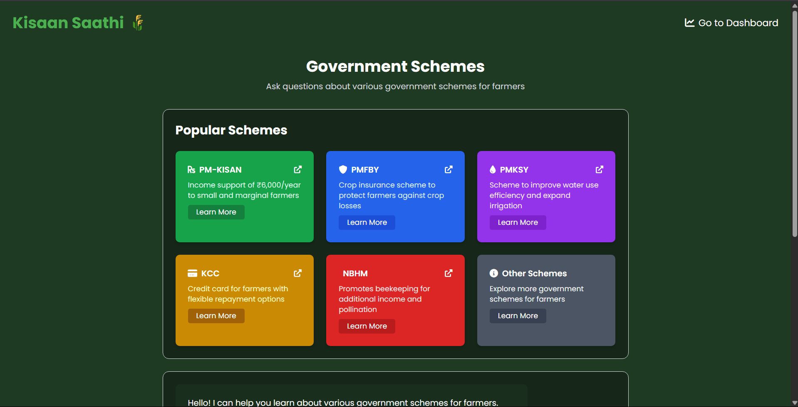

# 🌾 Kisaan Saathi (किसान साथी) – Empowering Farmers with AI

<p align="center">
  
</p>

[Life Demo Video](https://youtu.be/B1-36PqPhfA)

<p align="center">
  
  
  
  
  
  
  
</p>

---

## 📌 Overview

**Kisaan Saathi (किसान साथी)** is a comprehensive, AI-driven agricultural ecosystem designed to empower smallholder and marginal farmers with data-driven decision making. By unifying deep learning vision models, multi-agent conversational agronomists, precision irrigation calculators, and real-time mandi intelligence, Kisaan Saathi bridges the technological divide between agricultural science and the grassroots farmer.

---

## 🚀 Key Features

### 🔬 1. AI Crop Care & Disease Diagnosis
- **Dedicated Xception CNN Classifier:** Trained on **38 plant disease classes** across fruits, vegetables, and field crops.
- **Two-Stage Hybrid Architecture:**
  - *Stage 1 (Perception):* Sub-second deterministic pathogen identification from leaf photos.
  - *Stage 2 (Reasoning):* Automated LLM generation of **Dual Remediation Plans** (Organic/Bio-control + Safe chemical treatments with dilution metrics).
- **Out-of-Distribution Rejection:** Softmax calibration prevents visual hallucinations on non-crop images.

### 🤖 2. Multi-Agent Farmer Assistant with Clinical RAG
- **StateGraph Orchestration (LangGraph):** Autonomous multi-node routing between *Agronomy*, *Agricultural Finance*, *Government Schemes*, and *Mental Health*.
- **Structured Formatting:** Delivers crisp, high-readability responses with `###` headings and bold-keyword bullet points.
- **Mental Health & Debt Distress RAG:** Integrates a **ChromaDB vector database** loaded with verified psychological literature (`mental_health_Document.pdf`), offering empathetic coping strategies and immediate access to statutory toll-free helplines (Kisan Call Centre `1800-180-1551` / Tele-MANAS `14416`).

### 💧 3. Precision Crop Water Footprint Calculator
- **Random Forest Regression Pipeline:** Evaluates soil texture, regional evapotranspiration, rainfall, temperature, humidity, and irrigation methods (Drip vs. Sprinkler vs. Flood).
- **Optimized with 5-Fold GridSearchCV:** Calculates precise water volume ($m^3/\text{tonne}$) to prevent groundwater depletion while safeguarding yield.

### 📈 4. Real-Time APMC Mandi Market Intelligence
- **Data.gov.in Open Data API Integration:** Surfaces live Minimum, Maximum, and Modal wholesale rates across district mandis.
- **Zero-Downtime Deterministic Fallback:** Built-in cache seeded with historical modal pricing guarantees unbroken data access even when external government portals experience downtime.

### 🚜 5. Peer-to-Peer Equipment Rental Marketplace
- An accessible sharing economy connecting tractor and agricultural implement owners with marginal farmers for affordable hourly/daily rentals, eliminating prohibitive machinery capital expenditure.

### 🏛️ 6. Government Schemes & Subsidies Portal
- Centralized discovery hub for vital central and state schemes (PM-KISAN, PMFBY, Soil Health Card, PMKSY, KCC, e-NAM, FPO, CSC) with eligibility breakdowns and direct application links.

---

## 🏗️ System Architecture

```
[ Farmer Mobile / Web Browser ]
             │ (HTTP / JSON / Multi-part Uploads)
             ▼
[ FastAPI Backend Engine (ASGI / Uvicorn) ]
  ├── 1. Vision Engine: TensorFlow / Keras (38-class Xception Architecture)
  ├── 2. Conversational Engine: LangGraph StateGraph (Categorization + Sentiment Routing)
  │      └── Mental Health Subsystem: ChromaDB Vector Store + sentence-transformers/all-MiniLM-L6-v2
  ├── 3. Water Optimization: Scikit-Learn Pipeline (Random Forest Regressor)
  └── 4. External Integrations: Data.gov.in (APMC Mandi API) + OpenWeatherMap API
```

---

## 🛠️ Technology Stack

| Layer | Technologies |
|:---|:---|
| **Frontend** | HTML5, TailwindCSS, Bootstrap 5, Vanilla JavaScript, Marked.js, FontAwesome |
| **Backend API** | FastAPI, Uvicorn, Jinja2Templates, Python-Multipart, Pydantic |
| **Deep Learning & Vision** | TensorFlow, Keras, Xception Architecture, Pillow, NumPy |
| **Machine Learning** | Scikit-Learn (Random Forest, GridSearchCV, ColumnTransformer), Pandas, Joblib |
| **Agentic AI & RAG** | LangGraph, LangChain, ChromaDB, HuggingFace Sentence-Transformers (`all-MiniLM-L6-v2`) |
| **LLM Inference** | Groq LPU API (`openai/gpt-oss-20b` / LLaMA), Google Generative AI |
| **External APIs** | OpenWeatherMap API, Data.gov.in National Agriculture Market API |

---

## 📸 Screenshots

| Farmer Assistant & AI Chat | Disease Diagnosis & Treatment |
|:---:|:---:|
|  |  |

| RAG Chatbot | Water Footprint Calculator |
|:---:|:---:|
|  |  |

---

## ⚡ Installation & Local Setup

### Prerequisites
- Python 3.10 or 3.11 (Recommended)
- Git

### 1. Clone Repository
```bash
git clone https://github.com/anirbandutta-dev/KisanSathi
cd Kisaan-Sathi
```

### 2. Create and Activate Virtual Environment
```bash
# Windows
python -m venv venv
venv\Scripts\activate

# macOS / Linux
python3 -m venv venv
source venv/bin/activate
```

### 3. Install Dependencies
```bash
pip install --upgrade pip
pip install -r requirements.txt
```

### 4. Configure Environment Variables
Create a `.env` file in the root directory:
```env
GROQ_API_KEY=your_groq_api_key_here
GEMINI_API_KEY=your_gemini_api_key_here
DATA_GOV_API_KEY=your_data_gov_api_key_here
OPEN_WEATHER_API_KEY=your_openweather_api_key_here
```

### 5. Launch Application
```bash
python app.py
# or
uvicorn app:app --host 127.0.0.1 --port 8000 --reload
```
Open **`http://127.0.0.1:8000`** in your browser.

---

## 👥 The Team

Meet the minds behind **Kisaan Saathi**:

| Role | Name | GitHub Profile |
|:---|:---|:---|
| **Team Leader** | **Pritwish Saha** | [@PritwishSaha](https://github.com/PritwishSaha) |
| **Core Developer** | **Anirban Dutta** | [@anirbandutta](https://github.com/anirbandutta-dev) |
| **Core Developer** | **Souhardya Dey** | [@SouhardyaDey19](https://github.com/SouhardyaDey19) |
| **Core Developer** | **Asif Dhabak** | [@agentunknown007](https://github.com/agentunknown007) |

---

## 📜 License & Acknowledgments
- Developed for Hackathon presentation.
- Botanical dataset sourced from **PlantVillage**.
- Market statistics powered by **Data.gov.in Open Government Data (OGD) Platform India**.
- Dedicated to the hardworking farmers of India. 🌾
